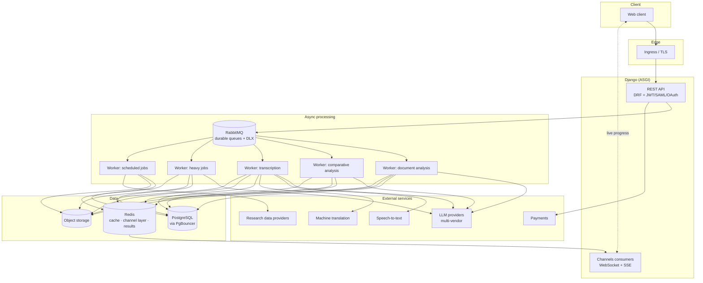
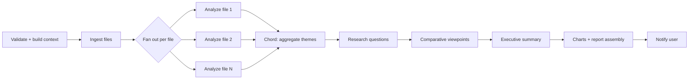

# [Evidano - Building an AI-Powered Qualitative Research Platform](https://www.evidano.com)

 - **Role:** Ai Backend / Platform Engineer
 - **Duration:** ~4 years
 - **Domain:** AI SaaS · Qualitative & quantitative research tooling
- **Stack:** Python · Django · Django REST Framework · Celery · RabbitMQ · Redis · PostgreSQL · Django Channels · Docker · Kubernetes · Azure

> **About this document.** This is a *technical case study*, not a code dump. The product is closed-source and commercially operated, so this document contains **no proprietary source code, no credentials, no internal hostnames, and no customer data**. Everything below describes architecture, engineering decisions, trade-offs, and outcomes — the parts of the work that are actually transferable.

---

## 1. TL;DR

I worked as a backend engineer on a multi-tenant SaaS platform that lets researchers run AI-assisted qualitative and quantitative analysis: uploading documents and spreadsheets, transcribing and translating audio/video, running AI-moderated voice interviews, and generating thematic analysis, comparative viewpoints, and visual reports.

The interesting engineering problem was never "call an LLM." It was **making long-running, expensive, failure-prone AI jobs behave like a reliable product** — jobs that run for minutes to hours, fan out across thousands of model calls, cost real money per run, must survive provider rate limits and pod restarts, and have to report progress to a browser in real time without lying to the user.

**What I built and owned across the platform:**

- Distributed task orchestration for multi-stage AI pipelines (Celery chains / groups / chords across dedicated queues)
- A provider-agnostic LLM gateway with structured-output validation, self-repair, and tiered retry
- Failure-classification and retry infrastructure that separates *transient* from *permanent* errors
- Real-time progress delivery over WebSockets and SSE
- Media pipeline: transcription, translation, speaker identification, multi-format export
- Billing and metering on top of Stripe (subscriptions, credits, top-ups, invoices)
- Third-party data-provider integrations with webhooks, scheduling, and rate-limit backpressure
- Kubernetes deployment concerns: worker autoscaling, health probes, connection pooling, CI/CD

---

## 2. System scale

Numbers describing the production system I worked in (whole-codebase figures, team-owned; my contributions are described per-section below):

| Dimension | Scale |
|---|---|
| Python modules (excluding migrations) | ~390 |
| Lines of application Python | ~72,000 |
| Django apps (bounded contexts) | 12 |
| Database models | 75 |
| Schema migrations | 264 |
| REST endpoints | 154 |
| Async/background task definitions | 40+ |
| Dedicated Celery queues | 8 |
| Automated tests | 450+ |
| Max task runtime supported | 12 hours (hard) / 11 hours (soft) |

---

## 3. Architecture at a glance

**Design principle:** the HTTP layer never does expensive work. It validates, authorizes, persists intent, enqueues, and returns. Everything costly happens in a worker that can be retried, autoscaled, and killed without data loss.

---

## 4. Engineering challenges

Each section follows the same shape: **the problem → what I did → why it mattered.**

### 4.1 Orchestrating multi-stage AI pipelines

**Problem.** A single "analyze my documents" request is not one job. Depending on which features the user enabled, it may involve: file ingestion and text extraction → thematic analysis → research-question answering → comparative viewpoint analysis → executive summary → chart and word-cloud generation → report assembly → notification. Steps have dependencies, some fan out per file, some must join before the next step, and a user can enable any subset.

**What I did.**

- Modeled the pipeline as a **builder**: a typed configuration object (project, user, file set, feature flags) is compiled into a Celery workflow using `chain` for sequencing, `group` for per-file fan-out, and `chord` for fan-in aggregation.
- Introduced an **orchestrator/validator split** — validation of project state, file availability, and instructions happens once, up front, and produces an immutable validated-context object. Workers never re-derive state from scratch or guess.
- Used frozen dataclasses with `__slots__` for the context objects passed between stages, so serialization stays cheap and stage boundaries stay explicit.
- Routed each stage to a **queue matched to its cost profile** (`addfilequeue`, `themeandresearchquestion`, `compareviewpoint`, `transcription`, `heavy_jobs`, `cron_jobs`, `getdata`, plus the default). A 40-minute thematic analysis can no longer starve a 2-second notification email.

**Why it mattered.** Adding a new analysis feature became a matter of registering a stage and a flag rather than rewriting task wiring. Queue isolation eliminated an entire class of "the whole app feels slow because one customer uploaded 400 files" incidents.

---

### 4.2 A provider-agnostic LLM gateway

**Problem.** The product depends on several model vendors. Vendors change APIs, deprecate models, rate-limit unpredictably, and return "JSON" that isn't. Direct SDK calls scattered across 40+ task modules would have made every vendor change a repo-wide refactor — and every malformed response a user-visible crash.

**What I did.**

- Built a **single gateway module** as the only path to any model. Callers construct a request object (messages, model, schema, generation params) and receive a normalized result object. Vendor SDK details never leak into business logic.
- Implemented **client pooling and caching** — synchronous clients cached per configuration, async clients cached *per event loop* via a weak-keyed map, so long-lived worker processes reuse connections instead of rebuilding TLS sessions on every call.
- Added **structured-output enforcement**: responses are parsed and validated against a JSON Schema. On a validation or parse failure the gateway performs a bounded **self-repair round-trip**, re-prompting the model with the specific parse error and demanding valid JSON only.
- Layered **two distinct retry tiers**, because they fail for different reasons:
  - *Transport tier* — timeouts, connection errors, rate limits, upstream 5xx → retried with randomized exponential backoff (jitter to avoid thundering-herd re-collisions), bounded attempts, exceptions re-raised on exhaustion.
  - *Semantic tier* — well-formed HTTP response, unusable content → repair prompt, then hard failure.
- Instrumented schema mismatches as **warnings with model and JSON path**, so a vendor silently regressing structured output shows up in logs as a trend rather than as a support ticket.

**Why it mattered.** Swapping or adding a model provider became a configuration concern. Malformed-response crashes stopped reaching users. And because retry policy lives in one place, tuning backoff during a provider incident is a one-line change, not an archaeology expedition.

---

### 4.3 Making failure boring

**Problem.** Naive Celery retry logic is actively harmful. Retrying a validation error burns money and delays the failure by hours. *Not* retrying a transient database blip loses a user's 40-minute job silently. Both had to stop.

**What I did.**

- Wrote an **exception-classification layer** that sorts every exception into transient vs permanent. Transient: rate limits, API timeouts, connection resets, broken pipes, upstream 5xx, database `OperationalError`/`InterfaceError`, provider-specific rate-limit and server-error types. Everything else is permanent and fails fast.
- Gave **rate-limit errors their own policy** — providers usually tell you how long to wait; the client surfaces `seconds_to_wait` rather than sleeping inside the HTTP client. The *caller* decides the countdown, so a worker slot is never blocked sleeping on someone else's quota.
- Configured a **Dead Letter Exchange** in RabbitMQ with a `.dlq` queue per work queue. Permanently failed tasks land somewhere inspectable instead of vanishing. Post-incident forensics went from "check the logs and hope" to "read the DLQ."
- Set **durable queues, persistent delivery mode, and publisher confirms**, so a broker restart doesn't drop accepted work.
- Set `worker_prefetch_multiplier=1` and `worker_max_memory_per_child`, so long tasks aren't hoarded by one worker and a slow memory leak recycles the child instead of OOM-killing the pod.
- Enabled `worker_cancel_long_running_tasks_on_connection_loss` to stop orphaned work continuing invisibly after a broker partition.

**Why it mattered.** This is the least glamorous work in the case study and the highest-leverage. It converted "the job just disappeared" — the worst possible support conversation — into either a completed job or a specific, attributable error.

---

### 4.4 Async concurrency inside synchronous workers

**Problem.** Analysis stages issue hundreds of independent model calls. Serially, a large project takes hours. But Celery's prefork workers are synchronous, and naively spinning up a fresh event loop per task leaks loops and file descriptors until the pod dies.

**What I did.**

- Implemented a **per-thread persistent event loop** helper: each worker thread gets one loop, created lazily, reused across tasks, recreated only if closed. Synchronous task code calls a single blocking bridge function to drive coroutines.
- Bounded fan-out with a **configurable concurrency limit** so a large project doesn't open unbounded concurrent connections and trip provider-side rate limits — which would convert a fast job into a slow, expensive, retry-heavy one.
- Kept the async client cache **keyed by event loop** so clients are never shared across loops (a subtle source of "event loop is closed" errors that only appear under production load).

**Why it mattered.** Large-project turnaround dropped from serial-bound to concurrency-bound, without the fd leaks and loop-lifecycle bugs that the obvious implementation produces.

---

### 4.5 Real-time progress, honestly reported

**Problem.** A job that takes 20 minutes with no feedback is indistinguishable from a broken job. Users refresh, re-submit, and double their bill.

**What I did.**

- Built **Django Channels consumers** over an ASGI deployment with Redis as the channel layer: separate consumers for global notifications, per-task progress streams, and interactive chat. Each authenticates from a token at connect time and joins a user-scoped group, so progress for one tenant can never fan out to another.
- Added an **SSE progress endpoint** as well, because not every client environment tolerates long-lived WebSockets (corporate proxies especially). Same progress data, second transport.
- Implemented a **progress service** that pipeline stages report into, with `_safe_progress` semantics — a progress-reporting failure can never fail the actual job. Telemetry is best-effort by design.
- For the AI chat surface, implemented **token-level SSE streaming** with a structured event envelope carrying incremental text, model reasoning traces, citations, attached files, terminal errors, and an explicit `done` flag — so the client always knows whether a stream ended or died.

**Why it mattered.** Perceived reliability is mostly feedback latency. Streaming progress cut duplicate submissions and made long jobs feel intentional rather than broken.

---

### 4.6 Cost engineering: batch processing

**Problem.** Categorizing a 50,000-row spreadsheet one API call at a time is slow and expensive. At real customer volumes the unit economics simply didn't work.

**What I did.**

- Moved bulk categorization onto the provider's **asynchronous Batch API** — submit a batch job, poll for completion, stream results back, reconcile against source rows.
- Built the surrounding lifecycle: batch submission, status polling on a scheduled queue, output retrieval, **partial-failure reconciliation**, and explicit failed-batch handling that notifies the user and marks project state rather than silently producing a half-filled sheet.
- Added a **result-reuse layer** so re-running an analysis over unchanged rows doesn't re-pay for identical work.

**Why it mattered.** Order-of-magnitude cost reduction on the highest-volume workload in the product, and the difference between "we can offer this tier" and "we can't."

---

### 4.7 The media pipeline

**Problem.** Turning arbitrary user media into research-grade transcripts is a long tail of format, language, and quality problems.

**What I did.** Built and maintained the transcription subsystem as a set of composable services:

- **Ingestion** — direct upload and URL-based ingestion, with format normalization before anything expensive begins.
- **Transcription** — third-party ASR integration driven by **webhooks** rather than polling, with idempotent webhook handling so duplicate deliveries (which always happen) don't double-charge or corrupt state.
- **Speaker identification** — diarization plus speaker labelling, with a transcript-editing layer so researchers can correct machine output.
- **Translation** — dedicated MT provider integration with language detection, plus segmentation handling for languages without whitespace word boundaries.
- **Export** — the same transcript rendered to document, subtitle (SRT/VTT), and structured JSON formats from one internal representation.
- **Sharing** — token-scoped share links so a transcript can be reviewed without an account, with expiry semantics.

**Why it mattered.** Transcription is where users first touch the product. Every format we couldn't ingest and every language we couldn't detect was a churn event.

---

### 4.8 Billing, metering, and credits

**Problem.** AI usage costs are variable and per-request; subscription billing is fixed and periodic. Reconciling those two without over-billing (support disaster) or under-billing (margin disaster) is genuinely hard.

**What I did.** Built the billing layer as discrete services with single responsibilities:

- **Subscription service** — plan lifecycle against the payment provider, driven by webhooks so the local state converges on the provider's state rather than diverging from it.
- **Credit grant service** — plan-included credits, grants, and expiry.
- **Top-up service** — mid-cycle purchases with immediate availability.
- **Pricing service** — a single place where cost rules live, so pricing changes don't require hunting through view code.
- **Invoice and upfront-invoice services** — including invoice-first flows for enterprise customers who cannot pay by card.
- **Usage metering** tied to actual job execution, so a failed job doesn't consume credit.

**Why it mattered.** Billing bugs destroy trust faster than outages. Isolating each concern meant pricing experiments could ship without touching the subscription state machine.

---

### 4.9 Third-party data-provider integrations

**Problem.** The platform pulls research data from external providers with rate limits, asynchronous job semantics, unstable vocabularies, and per-request billing.

**What I did.**

- Established an **anti-corruption boundary**: exactly one module may speak the vendor's dialect. Vendor status strings are normalized to an internal enum vocabulary — job, batch, and schedule lifecycles — before crossing that boundary. The rest of the codebase, and the frontend, share one status vocabulary regardless of provider.
- Enforced by convention (and documented in-module) that **the vendor's domain name appears in exactly one place**, so swapping or adding a provider is a bounded change.
- Made the client **never sleep on rate limits** — it raises a typed error carrying the retry delay and lets the Celery layer own the countdown. Backpressure belongs to the scheduler, not the socket.
- Built **scheduled recurring exports** with a per-user cap on active schedules, so one account cannot monopolize the shared quota.
- Added a **sandbox mode** switched by configuration, giving instant free sample data for tests and local development — CI never bills the company or depends on a third party being up.
- Implemented **webhook intake with idempotency** and typed event vocabulary.

**Why it mattered.** Integrations rot. Containing them behind a translation layer meant provider churn cost days instead of weeks, and the test suite stayed hermetic.

---

### 4.10 Security and access control

**Problem.** Research data is often sensitive — interview transcripts, human-subject data, unpublished findings. Enterprise buyers ask hard questions before signing.

**What I did.**

- **Multiple authentication paths**: JWT for the API, two-factor verification on login, OAuth social sign-in, and **SAML 2.0 SSO** for enterprise identity providers — with a backend chain that lets all of them coexist.
- **AES-GCM authenticated encryption** for scoped upload tokens: key derived from the application secret, random nonce per token, embedded timestamp, TTL enforcement, and distinct `BadSignature` / `SignatureExpired` failure modes. Tampering and expiry are separate, explicit outcomes — never a silent accept.
- **Rate limiting** with separate burst and sustained scopes, so a quick retry storm and a slow scraping campaign are throttled by different rules.
- **Content Security Policy** headers, and CORS/CSRF configured per environment rather than permissively in one place.
- **Group- and token-scoped real-time channels**, so no WebSocket subscription can be widened to another tenant's data.
- **Environment-separated settings** (base / development / production) so a development convenience can't reach production.

**Why it mattered.** SSO and a defensible data-handling story unblock enterprise deals. These are revenue features that happen to look like plumbing.

---

### 4.11 Running it on Kubernetes

**Problem.** AI workloads have wildly uneven load. Idle for an hour, then eight enterprise customers upload simultaneously. Static worker counts are either wasteful or a queue backlog.

**What I did.**

- Deployed each queue as its **own worker Deployment** with per-process autoscaling, so scaling decisions are per-workload rather than global.
- Implemented **real health probes** for Celery workers by running a small HTTP server inside the worker process exposing `/livez` and `/readyz`:
  - *Readiness* — has the worker actually booted and connected to the broker?
  - *Liveness* — has the worker completed a task recently, i.e. is it processing or wedged?

  This is the important detail: a Celery worker whose process is alive but whose consumer thread is deadlocked looks perfectly healthy to a naive process check. Heartbeat-staleness liveness catches the stuck-worker case that a PID check never will.
- Added **PgBouncer** in front of PostgreSQL. Dozens of worker processes × a connection pool each will exhaust Postgres connection limits long before they exhaust CPU; transaction pooling fixed it.
- Exposed **Prometheus metrics** from the Django application for request and queue observability.
- Maintained a **CI/CD pipeline** that builds the image, deploys to the cluster, and runs the test suite against the deployed environment.
- Documented **queue-backlog monitoring** via the broker's management UI as the primary "do we need more workers?" signal — a rising per-queue depth is a far better scaling trigger than pod CPU for I/O-bound AI work.

**Why it mattered.** The platform absorbs bursty load without manual intervention and without paying for peak capacity around the clock.

---

### 4.12 Agent tooling and conversational analysis

**Problem.** Researchers wanted to interrogate their own analyzed data conversationally, and to reach the platform from external AI clients.

**What I did.**

- Built an **MCP (Model Context Protocol) server** exposing platform capabilities as tools to external AI clients, with a strict output contract — tool results are whitelisted key-by-key before being returned, so internal fields can never leak into a third-party client's context.
- Implemented a **chatbot registry** with domain-specialized agents (general, project-scoped, spreadsheet-scoped) sharing a common base, selected by conversation context.
- Built the supporting conversation layer: persistence, file attachment handling, agent dispatch, and streaming responses.

**Why it mattered.** It turned static analysis output into something users could question — and made the platform reachable from the AI clients users already work in.

---

### 4.13 Testing a system full of external dependencies

**Problem.** Every meaningful code path in this system touches a paid, rate-limited, sometimes-down third-party service. That is the classic excuse for having no tests.

**What I did.**

- Kept a **450+ test suite** running under `pytest` with `pytest-django`, covering serializers, services, task handlers, billing logic, and integration boundaries.
- Made external clients **importable and constructible without configured Django settings**, resolving configuration lazily. This sounds trivial; it is what makes fast, hermetic unit tests possible at all.
- Used **provider sandbox modes and env-driven test configuration** so integration-shaped tests run for free and deterministically.
- Wired the suite into the deployment pipeline so it runs against a real deployed environment, not just a developer laptop.

---

## 5. Skills demonstrated

| Area | Specifics |
|---|---|
| **Languages** | Python (primary), SQL, JavaScript, Bash |
| **Web frameworks** | Django, Django REST Framework, Django Channels (ASGI), Daphne/Uvicorn, Gunicorn |
| **Distributed systems** | Celery (chains, groups, chords, routing, DLX), RabbitMQ, Redis, idempotency, backpressure, retry/backoff strategy |
| **AI/LLM engineering** | Multi-provider abstraction, structured outputs + schema validation, prompt/response repair loops, batch inference, token accounting, cost optimization, MCP tooling |
| **Async Python** | asyncio, event-loop lifecycle management in sync workers, connection pooling, bounded concurrency |
| **Real-time** | WebSockets (Channels), Server-Sent Events, token streaming, group-scoped pub/sub |
| **Data** | PostgreSQL, schema design across 75 models, migration management at scale, PgBouncer connection pooling, query-layer separation |
| **Infrastructure** | Docker, Kubernetes, HPA/worker autoscaling, liveness & readiness probe design, GitHub Actions CI/CD, Azure |
| **Observability** | Prometheus metrics, structured logging, dead-letter forensics, queue-depth-driven scaling signals |
| **Security** | JWT, 2FA, OAuth2, SAML 2.0 SSO, AES-GCM token encryption, CSP, tiered rate limiting, multi-tenant isolation |
| **Payments** | Stripe subscriptions, metered/credit billing, invoicing, webhook-driven state reconciliation |
| **Media** | ASR integration, diarization, machine translation, multi-format document/subtitle generation |
| **Practices** | Service-layer architecture, anti-corruption layers, typed data contracts, feature flags, environment-separated config, pytest, API documentation (OpenAPI/Swagger) |

---

## 6. Engineering judgment: things I'd argue for again

**Isolate queues by cost profile, early.** Merging all background work into one queue is the default and it is wrong the moment workloads have different durations. Separation cost an afternoon; not having it costs incidents.

**Classify exceptions before you configure retries.** "Retry 3 times" is not a policy, it's a superstition. Knowing *which* failures are worth retrying is what makes retries useful instead of expensive.

**One module owns each vendor.** Every integration will change, get deprecated, or be replaced. Containment is the only thing that makes that survivable, and it costs almost nothing to establish up front.

**Best-effort telemetry, never blocking.** Progress reporting, metrics, and notifications must never be able to fail the work they describe. This has to be a structural guarantee, not a code-review convention.

**Health checks should test the actual work loop.** A process-alive check on an async worker is close to useless — the failure mode you actually see in production is a live process with a wedged consumer. Probe the heartbeat, not the PID.

**Design for partial failure in every fan-out.** With hundreds of parallel model calls, "all succeeded" is not the common case. Every aggregation step needs a defined answer for partial results before it ships, not after the first incident.

---

## 7. Things I'd do differently

Honest retrospection, because a case study without it isn't credible:

- **Introduce the LLM gateway on day one.** It arrived after direct SDK calls had already spread. Consolidating them later was a large, avoidable refactor.
- **Version the pipeline contracts explicitly.** Stage-to-stage payloads evolved organically; explicit versioned contracts would have made rolling deploys safer during multi-hour jobs.
- **Push observability earlier.** Metrics and dead-letter forensics were added in response to incidents. Both would have been cheaper to build before I needed them at 2am.
- **Establish a golden-set evaluation harness for prompt changes sooner.** Model and prompt changes were validated more manually than I'd like; a regression suite for output quality belonged in CI.

---

## 8. Confidentiality note

This case study describes architecture, engineering trade-offs, and outcomes only. It deliberately excludes source code, configuration values, credentials, infrastructure addresses, vendor contract terms, customer data, and business metrics. Where a third-party vendor is unnamed, that is intentional.

---

<!--
CUSTOMIZATION CHECKLIST — delete this block before publishing.

1. Add your name, contact links, and dates at the top.
2. Confirm with your employer/client that publishing an architecture-level
   case study is acceptable. Most are fine with it; some contracts are not.
   Get it in writing if you can.
3. Adjust ownership language. This document says "I built" for the areas you
   owned and "the platform has" for team-owned surfaces. Go through §4 and
   make every claim precisely true for your own contribution — split credit
   explicitly where the work was shared. Interviewers probe this, and being
   the person who says "that part was a colleague's, here's what I did next
   to it" reads as strength, not weakness.
4. Replace the §2 scale table if you'd rather cite only what you personally
   authored. As written it describes the system, not your diff.
5. Consider naming the product if you have permission — a named, live product
   is significantly more persuasive than an anonymous one.
6. If you have real numbers (latency before/after, cost per job before/after,
   error-rate reduction, uptime), add them. Concrete deltas are the single
   biggest credibility upgrade available to this document.
7. Be ready to whiteboard any diagram here from memory. Everything in this
   document is fair game in an interview.
-->
